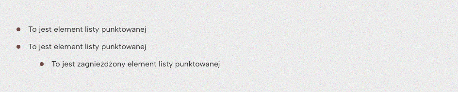
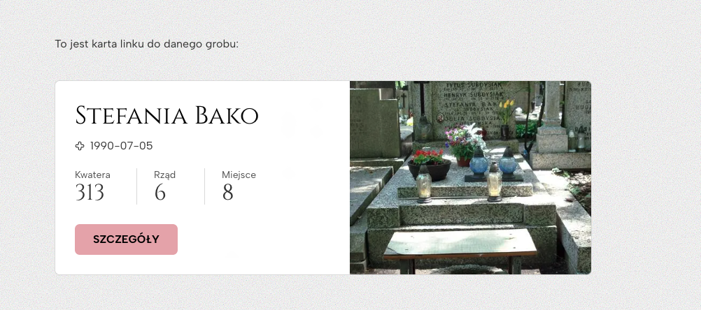
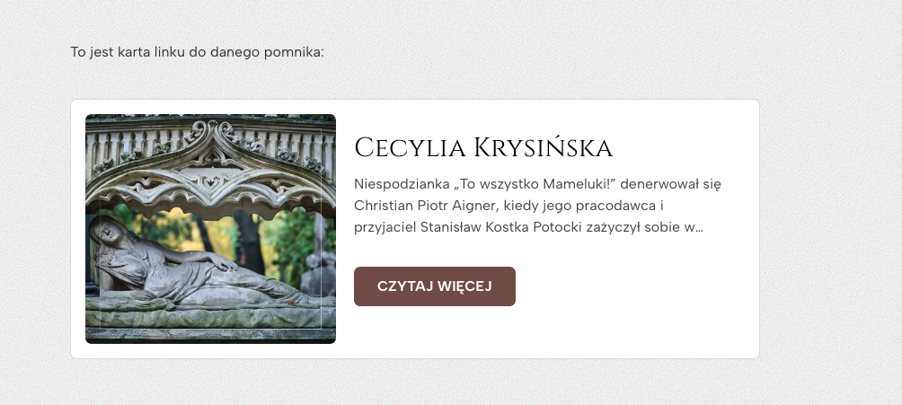
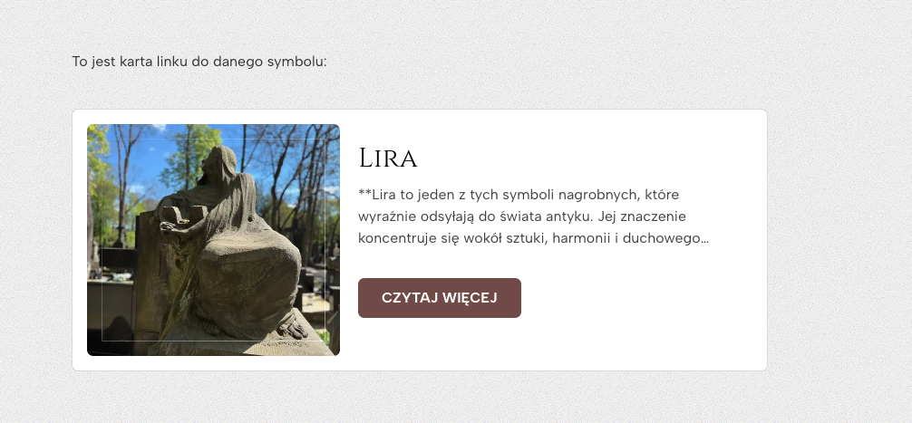
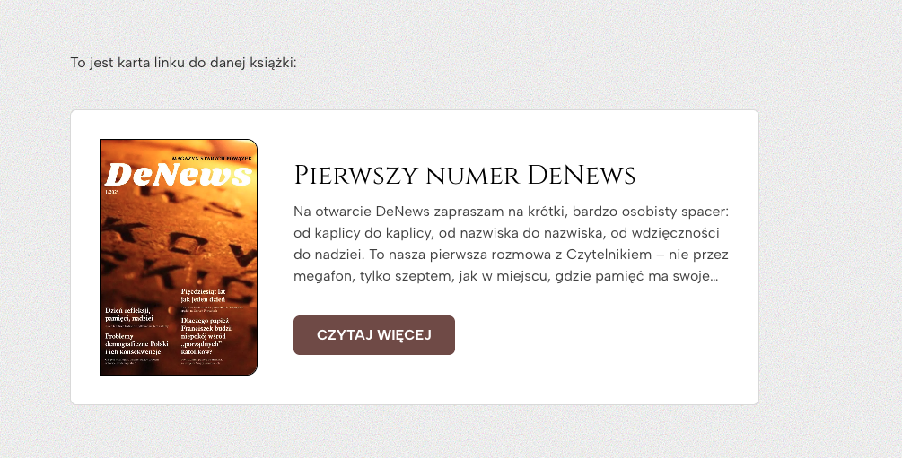
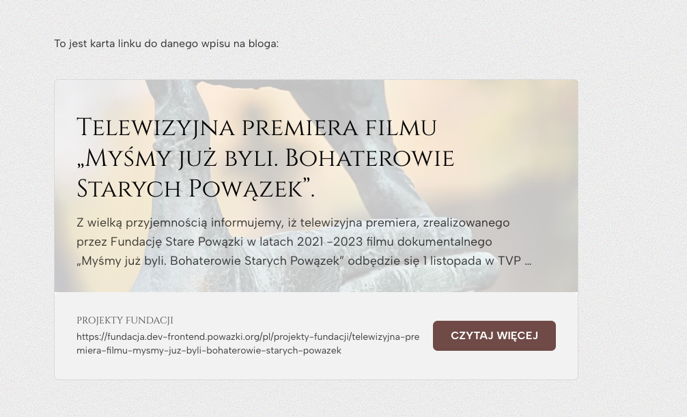
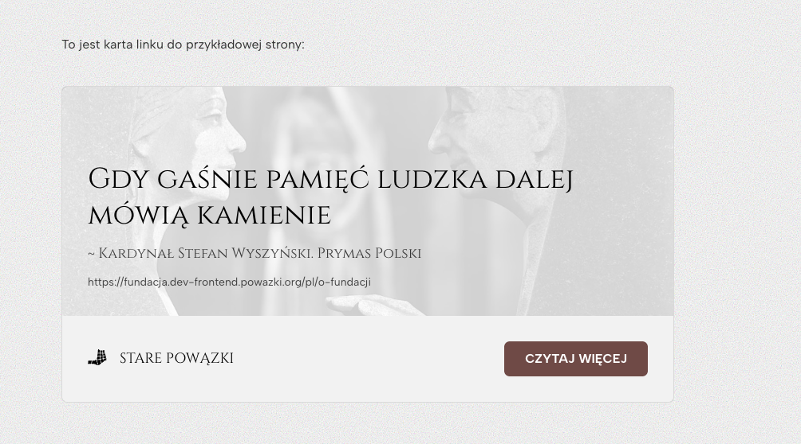
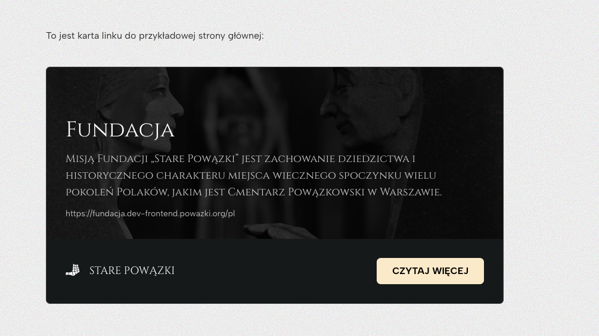

import { Tabs, TabItem } from "@astrojs/starlight/components";
import { l } from "../../../utils.ts";

Zarządzanie blogami polega na zarządzaniu blogami nadrzędnymi, tagami powiązanymi z blogami oraz wpisami na bloga.

## Zarządzanie blogami nadrzędnymi

Pierwszym z elementów związanych z blogami na stronie jest tzw. blog nadrzędny. Może być on traktowany jako element grupujący wpisy na bloga oraz tagi, które do wpisów mogą być przypisane. Przykładowe blogi nadrzędne, to **Aktualności Fundacji**, **Ogłoszenia duszpasterskie** czy też **Aktualności Cmentarza**.

### 1. Utworzenie bloga nadrzędnego

Aby utworzyć nowy blog nadrzędny, należy udać się do zakładki **RootBlogs**, klikąć przycisk **Create new entry**, uzupełnić wszystkie wymagane pola formularza, a na końcu zapisać go i opublikować.

<video src={l("/videos/blog/1.mp4")} controls width="100%"></video>

### 2. Utworzenie strony bloga

Strona internetowa musi wiedzieć, pod jakim adresem znajduje się dany blog nadrzędny. Na bazie tego ustalać będzie adresy konkretnych wpisów na bloga - przykładowo, jeżeli nasz blog nadrzędny znajdzie się na stronie `/nowy-blog`, to automatycznie strona `/nowy-blog/wpis-na-bloga` będzie pokazywać wpis na bloga opatrzony polem **Slug** z wartością `wpis-na-bloga`.

Aby przypisać blog danej stronie, należy udać się do zakładki **WebPages** i wybrać odpowiednią stronę, której chcemy przypisać dany blog nadrzędny. Następnie należy wybrać **Typ danych** jako `blog`. Pojawi się wówczas kolejne pole - **Blog** - którego wartość ustawiamy na odpowiedni blog nadrzędny, którego posty mają się pokazywać pod adresem naszej strony.

<video src={l("/videos/blog/2.mp4")} controls width="100%"></video>

Na końcu należy zapisać i opublikować daną stronę.

## Zarządzanie tagami danego bloga

Do bloga nadrzędnego przypisane są również tagi wpisów na bloga. Aby utworzyć nowy tag wpisów na bloga należy udać się do zakładki **BlogTags** i kliknąć przycisk **Create new entry**. Wówczas w formularzu: wpisujemy nazwę naszego tagu, generujemy jego slug, ustawiamy kolor danego tagu oraz przypisujemy tag do wybranego bloga nadrzędnego.

<video src={l("/videos/blog/3.mp4")} controls width="100%"></video>

## Dodawanie wpisów na bloga

Aby dodać nowy wpis na bloga, należy udać się do zakładki **BlogPosts** i kliknąć przycisk **Create new enetry**. Następnie uzupełniamy wszystkie wymagane pola - tytuł, generujemy slug, streszczenie oraz treść. Opcjonalnie dodać możemy także zdjęcie - okładkę danego wpisu na bloga. Na samym końcu, przypisujemy wpis do danego bloga nadrzędnego oraz dodajemy do niego wybrane przez nas tagi. Zapisujemy post. Jeżeli chcemy, by pokazał się on na stronie, publikujemy go.

<video src={l("/videos/blog/4.mp4")} controls width="100%"></video>

### Formatowanie treści wpisów na bloga

Treść wpisów na bloga może zostać uatrakcyjniona poprzez wykorzystanie dodatkowych bloków zawartości w polu tekstowym. Aby z nich skorzystać, należy rozwinąć listę bloków zawartości klikając w menu z napisem **Text**. Poniżej znajdują się szczegółowe opisy najważniejszych bloków zawartości możliwych do umieszczenia w treści wpisu na bloga.

#### 1. Nagłówki

Podstawowym elementem formatowania tekstu są nagłówki. Dostępnych jest sześć rozmiarów nagłówków, kolejno od **Heading 1** do **Heading 6** (od największego do najmniejszego).

<video src={l("/videos/blog/5.mp4")} controls width="100%"></video>

Poniżej znajduje się przedstawienie wyglądu poszczególnych nagłówków tekstu:

<Tabs>
  <TabItem label="Heading 1"></TabItem>
  <TabItem label="Heading 2"></TabItem>
  <TabItem label="Heading 3"></TabItem>
  <TabItem label="Heading 4"></TabItem>
  <TabItem label="Heading 5"></TabItem>
  <TabItem label="Heading 6"></TabItem>
</Tabs>

#### 2. Listy

Kolejnym elementem formatowania tekstu są listy. Dostępne są dwa warianty - lista numerowana (**Numbered list**) oraz lista punktowana (**Bulleted list**).

<video src={l("/videos/blog/6.mp4")} controls width="100%"></video>

Poniżej znajduje się przedstawienie wyglądu poszczególnych list:

<Tabs>
  <TabItem label="Lista numerowana">
    
  </TabItem>
  <TabItem label="Lista punktowana">
    
  </TabItem>
</Tabs>

#### 3. Zdjęcia w tekście

Kolejnym elementem są zdjęcia możliwe do umieszczenia pomiędzy tekstem. Aby umieścić takie zdjęcie, należy wybrać z listy blok **Image**, a następnie zaznaczyć zdjęcie, które chcemy umieścić w treści wpisu na bloga.

<video src={l("/videos/blog/7.mp4")} controls width="100%"></video>

Poniżej znajduje się przedstawienie wyglądu zdjęcia umieszczonego w tekście:

#### 4. Znacznik daty

Kolejnym elementem formatowania tekstu jest znacznik daty. Pozwala on na ciekawą prezentację omawianej daty oraz wyróżnienie jej względem treści, w której data ta się znajduje. Aby umieścić taki znacznik, należy wybrać z listy blok **Date marker**, a następnie uzupełnić datę (i opcjonalnie jej opis wraz z kolorem znacznika).

<video src={l("/videos/blog/8.mp4")} controls width="100%"></video>

Poniżej znajduje się przedstawienie wyglądu znacznika daty umieszczonego w tekście:

#### 5. Cytat

Kolejnym elementem formatowania tekstu jest wyróżniony cytat. Pozwala on na ciekawą prezentację przytoczonego cytatu. Aby umieścić taki cytat, należy wybrać z listy blok **Quote text**, a następnie uzupełnić cytat (i opcjonalnie jego ustawienia kolorystyczne).

<video src={l("/videos/blog/9.mp4")} controls width="100%"></video>

Poniżej znajduje się przedstawienie wyglądu cytatu umieszczonego w tekście:

#### 6. Zagnieżdżenia

Kolejnym elementem są zagnieżdżenia. Aby dodać zagnieżdżenie do treści wpisu na bloga, należy wybrać blok **Embed**.

<video src={l("/videos/blog/10.mp4")} controls width="100%"></video>

Dostępnych jest pięć wariantów zagnieżdżeń:

1. Zagnieżdżenie z filmem (**Video**)

   Zagnieżdżenie to jest przydatne, gdy chcemy umieścić film z wybranego serwisu z filmami w środku treści naszego wpisu na bloga.

   :::note
   Aby umieścić film z serwisu YouTube, należy wejść na stronę danego filmu na tej platformie, kliknąć przycisk **udostępnij**, wybrać opcję **Umieść**, a następnie skopiować adres filmu znajdujący się wewnątrz kodu, który zostanie pokazany na ekranie. Przykładem takiego adresu jest `https://www.youtube.com/embed/MLTkW8Y1iY4`. Inną opcją umieszczenia filmu z platformy YouTube będzie skopiowanie całego kodu pokazanego w tym oknie, i wklejenie go do zagnieżdżenia o typie **Plain HTML**.
   :::

2. Zagnieżdżenie z mapą (**Mapa**)

   Zagnieżdżenie to jest przydatne, gdy chcemy pokazać lokalizację pewnego obiektu na mapie, np. umiejscowienie Cmentarza Stare Powązki na mapie Warszawy.

3. Zagnieżdżenie z kodem HTML do wklejenia (**Plain HTML**)

   Zagnieżdżenie to jest przydatne, gdy serwis, z którego chcemy umieścić zagnieżdżenie, wymaga wklejenia od nas kodu HTML. Przykładem takiego serwisu jest strona Sketchfab z modelami 3D. Wystarczy wówczas wkleić wymagany kod do zagnieżdżenia o tym typie, a pokaże się on bez problemu w treści naszego wpisu.

4. Zagnieżdżenie z adresem URL (**Inny**)

   Jeżeli chcemy umieścić zagnieżdżenie do danej strony internetowej, a nie umożliwia ona opcji umieszczenia zagnieżdżenia, możliwe jest dodanie takiego elementu poprzez wklejenie adresu URL do tej strony do zagnieżdżenia z typem **Inny**.

   :::caution
   Nie każda strona internetowa umożliwia umieszczenie jej zawartości w innych stronach, nawet w tym typie zagnieżdżenia.
   :::

5. Zagnieżdżenie wyszukiwarki grobów (**Wyszukiwarka grobów**).

   Przykładem zastosowania takiego zagnieżdżenia jest wspomnienie o dostępnej Wyszukiwarce Grobów Stare Powązki w treści wpisu na bloga. Możemy wówczas umieścić wyszukiwarkę w treści wpisu, który o niej wspomina, aby ułatwić do niej dostęp.

Poniżej znajduje się przedstawienie wyglądu poszczególnych rodzajów zagnieżdżeń:

<Tabs>
  <TabItem label="Film"></TabItem>
  <TabItem label="Mapa"></TabItem>
  <TabItem label="Kod HTML"></TabItem>
  <TabItem label="Adres URL"></TabItem>
  <TabItem label="Wiki"></TabItem>
</Tabs>

#### 7. Zdjęcie przy tekście

Kolejnym elementem umożliwiającym formatowanie treści wpisów na bloga jest zdjęcie przy tekście. Aby dodać takie zdjęcie, należy wybrać blok **Floating Image**. Po jego wybraniu należy wybrać zdjęcie, które ma być pokazane przy tekście, korzystając z przycisku **Wybierz zdjęcie**. Po wybraniu zdjęcia, należy zdecydować w którym miejscu względem tekstu zdjęcie to ma być umieszczone - po prawej, czy też po lewej stronie. Możliwe jest również dodanie podpisu pod zdjęciem, korzystając z pola **Opis**. Na samym końcu, możemy uzupełnić pole **Treść** zawartością, która widoczna ma być obok naszego zdjęcia.

<video src={l("/videos/blog/11.mp4")} controls width="100%"></video>

:::note
Możliwe jest także zaznaczenie wybranego akapitu, i wybranie bloku **Floating Image** z aktywnym zaznaczeniem tekstu. Wówczas tekst sam zostanie przeniesiony do pola **Treść** bloku **Floating Image**.
:::

Poniżej znajduje się przedstawienie wyglądu zdjęcia umieszczonego obok tekstu:

#### 8. Karta

Kolejnym elementem, który możemy umieścić w tekście jest karta. Pozwala ona na prezentację treści w sposób wyróżniony względem tekstu - przykładem zastosowania karty może być umieszczenie w niej opisu osoby powiązanej z daną lekcją z witryny Edukacja Stare Powązki. Aby dodać kartę, należy wybrać blok **Inline Card** oraz uzupełnić wszystkie jej pola - **Tytuł**, **Podtekst** oraz **Treść**.

<video src={l("/videos/blog/12.mp4")} controls width="100%"></video>

:::note
Możliwe jest także zaznaczenie wybranego akapitu, i wybranie bloku **Inline Card** z aktywnym zaznaczeniem tekstu. Wówczas tekst sam zostanie przeniesiony do pola **Treść** bloku **Inline Card**.
:::

:::note
Jeżeli umieścimy pod sobą więcej niż jedną kartę, na większych ekranach zostaną one wyświetlone w postaci siatki 2x2.
:::

Poniżej znajduje się przedstawienie wyglądu karty:

#### 9. Siatka zdjęć

Innym elementem pozwalającym na urozmaicenie treści naszego wpisu jest siatka zdjęć. Pozwala ona na wyświetlenie większej ilości zdjęć w formie siatki, która zależnie od ilości zdjęć wyświetla dwa zdjęcia obok siebie, albo siatkę 4x4. Aby dodać siatkę zdjęć, należy wybrać blok **Image Grid**, a następnie wybrać zdjęcia korzystając z przycisku **Wybierz zdjęcia**.

<video src={l("/videos/blog/13.mp4")} controls width="100%"></video>

Poniżej znajduje się przedstawienie wyglądu siatki zdjęć:

### Korzystanie z kart z linkami

Podczas dodawania treści wpisyu na bloga, możemy także skorzystać z funkcji automatycznego generowania kart z linkami. Jeżeli wkleimy link znajdujący się na naszej stronie - np. do grobu, książki, symbolu, pomnika, wpisu na bloga, czy też dowolnej jej podstrony - automatycznie wygenerowane zostaną karty dekoracyjne prowadzące do danego linku.

Wygląd takich kart można przejrzeć poniżej:

<Tabs>
  <TabItem label="Grób"></TabItem>
  <TabItem label="Pomnik">
    
  </TabItem>
  <TabItem label="Symbol">
    
  </TabItem>
  <TabItem label="Książka">
    
  </TabItem>
  <TabItem label="Wpis na bloga">
    
  </TabItem>
  <TabItem label="Podstrona">
    
  </TabItem>
  <TabItem label="Strona główna">
    
  </TabItem>
</Tabs>
